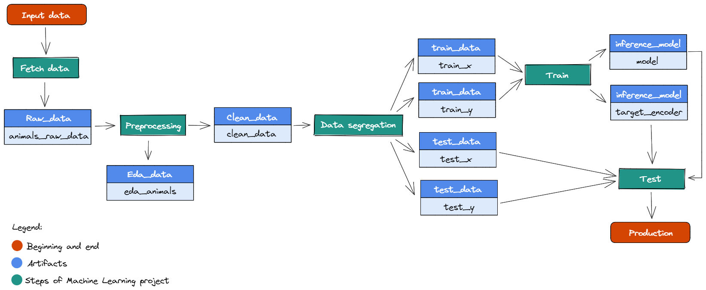

## :camera: Image classifier: dog, cat or panda
This project aims to create different models of Machine Learning (ML) to solve the following problem: given an image, classify it as an image that contains a dog, a cat or a panda. For this project, three ML models will be used for the image classification:
- __K-nearest neighbors__ (KNN) algorithm, from the library scikit-learn;
- __Multi-layer perceptron classifier__ (MLPClassifier), from the library scikit-learn;
- __Convolucional neural network__ (CNN), from the library TensorFlow.

## :bulb: Project flow
For this project, it was also used the tool named Weights & Biases (also known as Wandb) to make the model management. Based on its operation, the big-picture of the data pipeline used in this project can be seen in the figure below.



In general, for each stage of the data pipeline it was created a notebook in Google Colaboratory, containing five stages: `fetch data`, `preprocessing`, `data segregation`, `train`, `test`. It is important to know that the `fetch data` stage it was executed just once, because the same dataset will be used for the three ML models that will be implemented. Also, in the last ML model (CNN), two more artifacts were generated: `validation_x` and `validation_y`. 

## :chart_with_upwards_trend: Results

Initially, those three ML models were executed to see the results as accuracy and confusion matrix of the models. However, the first results were not really good, speacially for the `MLPClassifier`, so, it was used a technique named `hyperparameter tuning`. It consists of find the best hyperparameter values for a ML algorithm applying different combinations of hyperparameters that maximizes the model performance and miminizes a predefined loss function to produce better results with fewer errors.

In the table below, we can see the principal metrics of each model:
Model                         |Accuracy|Precision|Recall|F1-Score
------------------------------|:--------:|:---------:|:------:|:--------:
KNN                           | 0.469    | 0.542     | 0.469  | 0.474
MLPClassifier (without sweep) | 0.537    | 0.572     | 0.537  | 0.516
MLPClassifier (with sweep)    | 0.557    | 0.575     | 0.557  | 0.551
CNN (without sweep)           |          |           |        |
CNN (with sweep)              | 0.680    |  0.688    | 0.680  | 0.683

## :leaves: Environmental considerations

Considering the entire context of ecological awareness and environmental preservation that we live today, a library named `codecarbon` was used to measure the amount of energy spent and the amount of CO² released for the training of a neural network. Since the CNN is the neural network with the highest computational cost, the amount of energy and CO² were measured just for your training, with and without hyperparameter tuning.

## :computer: How to run this project

1- Create an account at [Wandb site](https://wandb.ai/).

2- Clone this repository with the following command:
```
git clone https://github.com/marianabritoazevedo/embedded-ai.git
```
3- Put all the codes inside the folder `Image_classifier` at [Google Colaboratory](https://colab.research.google.com/).

4- Inside every code, change the name `marianabritoazevedo` for the name of your user at Wandb. For example:
```
run = wandb.init(entity="your_user_name",project=args["project_name"], job_type="data_segregation")
```

5- Run the files inside the folder `Image_classifier/KNN_classifier` in the following order:
   - fetch data >> preprocessing >> data_segregation >> train >> test

6- Run the files inside the folder `Image_classifier/MLP_classifier` in the following order:
   - preprocessing >> data_segregation >> train >> test

7- Run the files inside the folder `Image_classifier/CNN_classifier` in the following order:
   - preprocessing >> data_segregation >> train >> test

## :books: References
- Ivanovitch's repository for embedded artificial intelligence repository ([here](https://github.com/ivanovitchm/embedded.ai));
