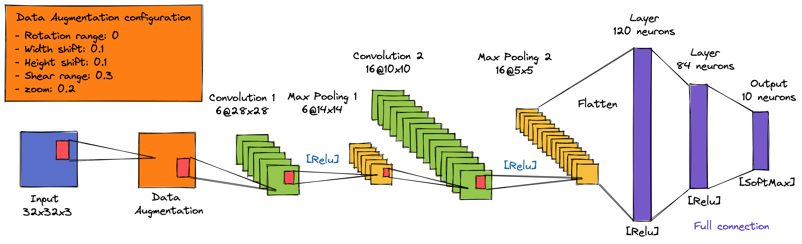

## Hyperparameter Tuning with sweep

One of the first and best known convolutional neural networks is LeNet-5, described by Yann LeCun, et al. in their 1998 paper titled [Gradient-Based Learning Applied to Document Recognition](https://ieeexplore.ieee.org/document/726791). The system was developed for use in a handwritten character recognition problem and demonstrated on the MNIST standard dataset, achieving approximately 99.2% classification accuracy (or a 0.8% error rate). The network was then described as the central technique in a wider system referred to as Graph Transformer Networks.

With that in mind, we performed hyperparameter tuning using [Weights and Biases](https://wandb.ai) for three models based on LeNet5:

- **Model 1**: from the architecture of the original paper, a sweep was performed with other activation functions, more convolutional layers, other filter sizes, batch sizes etc.

- **Model 2**: another sweep was performed using data augmentation by varying parameters such as zoom, shear, among others, and also testing techniques such as dropout, batch normalization, etc.

-  **Model 3**: the model made by applying new layers, such as dropout and batch normalization, in addition to the use of sweep.

It is important to highlight that this work was carried out in a group. [Mariana Azevedo](https://github.com/marianabritoazevedo) [](https://github.com/marianabritoazevedo/embedded-ai/tree/main/LeNet-IvaNet) was responsible for the first part,  [Morsinaldo Medeiros](https://github.com/Morsinaldo) [](https://github.com/Morsinaldo/embedded_artificial_intelligence/tree/main/projects/lenet5) was responsible for the second part and  [Thaís Medeiros](https://github.com/thaisaraujo2000?tab=repositories) [](https://github.com/thaisaraujo2000/embedded_artificial_intelligence/tree/main/projects/project_2) was responsible for the third part.


## Model 1: LeNet-5

In section II. B., the paper describes the network architeture as having seven layers with input grayscale images having the shape 32 x 32, the size of images in the MNIST dataset.

The model proposes a pattern of a convolutional layer followed by an average pooling layer, referred to as a subsampling layer.

This pattern is repeated two and a half times before the output feature maps are flattened and fed to some fully connected layers for interpretation and a final prediction. A picture of the network architecture is provided in the paper and reproduced below.

### :mag: Settings for hyperparameter tuning 

The configurations of the sweep to make the hyperparameter tuning for the LeNet-5 CNN are described below:
*  `conv_layer`: number of convolutional layers. The possibilities are 2, 3 or 4;
*  `pooling`: the type of technique used in pooling layer. The possibilities are 0 (max pooling) or 1 (average pooling);
*  `qtd_filters`: the number of filters used at the convolutional layers. The possibilities are 4, 8, 16 or 32;
*  `filter_size`: the size of the filters used at the convolutional layers. The possibilities are 2 (2x2), 3 (3x3), 4 (4x4) or 5 (5x5);
*  `learn_rate`: the step size at each iteration while moving toward a minimum of a loss function. The possibilities are 0.01 or 0.001;
*  `epoch`: the number of epochs which the CNN will be trained. The possibilities are 20 or 40;
*  `batch_size`: the size of the batch. The possibilities are 32 or 64.

### :trophy: Best configuration

The parameters for the sweep were chosen randomly, and there were tested 10 different types of configuration to the LeNet-5.

The best configuration can be seen in the image below, which has __4__ convolutional layers with __16__ filters __5x5__, the pooling layer using __AveragePooling__, and it has the number __0.01__ as learning rate and __32__ as the size of the batch. This configuration achieved an accuracy of 98.82%.


### :chart_with_upwards_trend: Metrics

The table below shows the metrics obtained in all 10 different configurations tested. We can see that only one configuration obtained bad results, but the other 9 configurations reached an accuracy over 80%.

Run                           |Accuracy|Precision|Recall|F1-Score
--------------------------------|:--------:|:---------:|:------:|:--------:
[earnest-sweep-9](https://wandb.ai/marianabritoazevedo/lenet-5/runs/n8u016u1?workspace=user-marianabritoazevedo)               | 0.9882   | 0.9882    | 0.9882 | 0.9882
[sandy-sweep-3](https://wandb.ai/marianabritoazevedo/lenet-5/runs/k0a8k2jn?workspace=user-marianabritoazevedo)                 | 0.9864   | 0.9864    | 0.9864 | 0.9864 
[faithful-sweep-6](https://wandb.ai/marianabritoazevedo/lenet-5/runs/sfyxivd6?workspace=user-marianabritoazevedo)              | 0.9761   | 0.9761    | 0.9761 | 0.9761 
[worldly-sweep-7](https://wandb.ai/marianabritoazevedo/lenet-5/runs/itia2avr?workspace=user-marianabritoazevedo)               | 0.961    | 0.9611    | 0.961  | 0.961
[denim-sweep-2](https://wandb.ai/marianabritoazevedo/lenet-5/runs/ezbpah6p?workspace=user-marianabritoazevedo)                 | 0.9481   | 0.9481    | 0.9481 | 0.948
[vocal-sweep-10](https://wandb.ai/marianabritoazevedo/lenet-5/runs/zt4scujp?workspace=user-marianabritoazevedo)                | 0.9374   | 0.9373    | 0.9374 | 0.9373
[usual-sweep-1](https://wandb.ai/marianabritoazevedo/lenet-5/runs/kgmvbof1?workspace=user-marianabritoazevedo)                 | 0.9119   | 0.9123    | 0.9119 | 0.9119
[wild-sweep-8](https://wandb.ai/marianabritoazevedo/lenet-5/runs/rlxibbnd?workspace=user-marianabritoazevedo)                  | 0.8667   | 0.867     | 0.8667 | 0.8663
[summer-sweep-4](https://wandb.ai/marianabritoazevedo/lenet-5/runs/dzd967ie?workspace=user-marianabritoazevedo)                | 0.8284   | 0.8277    | 0.8284 | 0.8254
[legendary-sweep-5](https://wandb.ai/marianabritoazevedo/lenet-5/runs/a9husrf9?workspace=user-marianabritoazevedo)             | 0.4834   | 0.4557    | 0.4834 | 0.433

The image below shows the results reached according to the parameters of each sweep.


Then, we can observe, respectively, the accuracy and loss graph, the output of the classification report and the confusion matrix to the best model obtained in the sweep.

<p align="center" style="text-align:center">
    
    <p align="center">Accuracy and Loss Graph</p> 
</p align="center">


<p align="center" style="text-align:center">
    
    <p align="center">Classification Report</p>
</p align="center">

<p align="center" style="text-align:center">
    
    <p align="center">Confusion matrix</p>
</p align="center">

As observed in the confusion matrix, the model was more confused predicting the numbers 4 and 7 when it was actually the number 9.


## Model 2: Data Augmentation

This method slightly changes the appearance of the training data before passing it to the network, thus causing the network to consistently see "new" training data points generated from the original data. This partially alleviates the need for us to collect more training data (although, in general, collecting more training data rarely hurts your algorithm).

Data augmentation encompasses a wide range of techniques used to generate new training samples from the originals, applying random jitters and perturbations so that the class labels do not change.

Our goal when applying data augmentation is to increase the generalizability of the model, as since our network is constantly seeing new and slightly modified versions of the input data points, it can learn more robust features.

At the time of testing, we do not apply data augmentation and evaluate our trained network – in most cases you will see an increase in test accuracy, perhaps at the expense of a slight drop in training accuracy.

You can read more data augmentation at this link: [Complete Guide to Data Augmentation for Computer Vision](https://towardsdatascience.com/complete-guide-to-data-augmentation-for-computer-vision-1abe4063ad07)

### :mag: Settings for hyperparameter tuning 

The configurations of the sweep to make the hyperparameter tuning to the LeNet-5 CNN are described below:
*  `conv_layer`: number of convolutional layers. The possibilities are: 1 or 2;
*  `batch_norm`: batch normalization. The possibilities are: True or False. If it's true, we put a batch normalization layer, otherwise we don't put;
*  `dropout`: some neurons are statistically deactivated during training. The possibilities are: 0.0, 0.25 or 0.5;
*  `rotation`: rotation range of data augmentation. The possibilities are: 2 (2x2), 3 (3x3), 4 (4x4) or 5 (5x5);
*  `learn_rate`: the step size at each iteration while moving toward a minimum of a loss function. The possibilities are: 0.001 or 0.005;
*  `epoch`: the number of epochs which the CNN will be trained. The possibilities are: 15 or 30;
*  `batch_size`: the size of the batch. The possibilities are: 32 or 64.
* `width_shift`: The width shift range. The possibilities are: 0.1, 0.2 or 0.3.
* `height_shift`: The height shift range. The possibilities are: 0.1, 0.2 or 0.3
* `shear`: The shear range. The possibilities are: 0.1, 0.2 or 0.3
* `zoom`: The zoom range. possibilities are: 0.1, 0.2 or 0.3

For reproducible purposes, we set a seed using the following command:

```python
tf.random.set_seed(42)
```

### :trophy: Best configuration

The parameters for the sweep were chosen randomly, and there were tested 10 different types of configuration to the LeNet-5.

The best configuration can be seen in the image below, which has __2__ convolutional layers: one with __6__ filters __5x5__  and one with __16__ filters __5x5__. Next, we have the pooling layer using __MaxPooling__, and it has the number __0.001__ as the learning rate and __32__ as the batch value. In the end, we have a flat layer followed by three fully connected layers with 120, 84 and 10 neurons, respectively. This configuration achieved an accuracy of 99.31%.



### :chart_with_upwards_trend: Metrics

The table below shows the metrics obtained in all 10 different configurations tested. We can see that al configurations reached an accuracy over 96 over test dataset.

Run                         |Accuracy|Precision|Recall|F1-Score
------------------------------|:--------:|:---------:|:------:|:--------:
[bright-sweep-9](https://wandb.ai/morsinaldo/lenet-5/runs/pz2p5om2?workspace=user-morsinaldo)                | 0.9931   | 0.9931    | 0.9931 | 0.9931
[lunar-sweep-2](https://wandb.ai/morsinaldo/lenet-5/runs/qznrk35g?workspace=user-morsinaldo)                 | 0.9868   | 0.9869    | 0.9868 | 0.9868 
[robust-sweep-6](https://wandb.ai/morsinaldo/lenet-5/runs/jn4i8qas?workspace=user-morsinaldo)                | 0.9866   | 0.9867    | 0.9866 | 0.9866 
[swift-sweep-8](https://wandb.ai/morsinaldo/lenet-5/runs/f8cggox8?workspace=user-morsinaldo)                 | 0.9832   | 0.9833    | 0.9832 | 0.9832
[rosy-sweep-7](https://wandb.ai/morsinaldo/lenet-5/runs/vaxsxe36?workspace=user-morsinaldo)                  | 0.9827   | 0.9828    | 0.9827 | 0.9827
[proud-sweep-1](https://wandb.ai/morsinaldo/lenet-5/runs/s5j7jlue?workspace=user-morsinaldo)                 | 0.9825   | 0.9826    | 0.9825 | 0.9825
[vocal-sweep-4](https://wandb.ai/morsinaldo/lenet-5/runs/3z3uud5o?workspace=user-morsinaldo)                 | 0.9804   | 0.9806    | 0.9804 | 0.9804
[dandy-sweep-10](https://wandb.ai/morsinaldo/lenet-5/runs/exzd90g6?workspace=user-morsinaldo)                | 0.9785   | 0.9786    | 0.9785 | 0.9785
[leafy-sweep-3](https://wandb.ai/morsinaldo/lenet-5/runs/z8089w2t?workspace=user-morsinaldo)                 | 0.9658   | 0.9661    | 0.9658 | 0.9658
[earthy-sweep-5](https://wandb.ai/morsinaldo/lenet-5/runs/2dkykiqt?workspace=user-morsinaldo)                | 0.9652   | 0.9661    | 0.9652 | 0.9653

The image below shows the results reached according to the parameters of each sweep.


Then, we can observe, respectively, the accuracy and loss graph, the output of the classification report and the confusion matrix to the best model obtained in the sweep.

<p align="center" style="text-align:center">
    
    <p align="center">Accuracy and Loss Graph</p> 
</p align="center">


<p align="center" style="text-align:center">
    
    <p align="center">Classification Report</p>
</p align="center">


<p align="center" style="text-align:center">
    
    <p align="center">Confusion Matrix</p>
</p align="center">

As observed in the confusion matrix, the model was more confused predicting the number 7 when it was actually the number 2.

## Model 3: KakashiNet

The purpose of KakashiNet architecture is to explore the use of batch normalization and dropout, using the ReLU activation function.

### :mag: Settings for hyperparameter tuning 
The configurations of the sweep to make the hyperparameter tuning to the KakashiNet arquitecthure are described below:
*  `conv_layer`: number of convolutional layers. The possibilities are 1, 2 or 3;
*  `learn_rate`: the step size at each iteration while moving toward a minimum of a loss function. The possibilities are 0.01, 0.001 or 0.005;
*  `epoch`: the number of epochs which the CNN will be trained. The possibilities are 5 or 30;
*  `batch_size`: the size of the batch. The possibilities are 32 or 64;
*  `dropout`: some neurons are statistically deactivated during training. The possibilities are 0.0, 0.25 or 0.5.

### :trophy: Best configuration

The parameters for the sweep were chosen randomly, and there were tested 10 different types of configuration to the KakashiNet architecture.

The best configuration can be seen in the image below, which has __4__ convolutional layers, we have the pooling layer using __AveragePooling__, __0.001__ as the learning rate, __64__ as the batch size value. Furthermore, all dropout layers were 0.25. In the end, it has a flatten layer followed by three fully connected layers with 120, 84 and 10 neurons, respectively. This configuration achieved an accuracy of 99.47%.


### :chart_with_upwards_trend: Metrics

The table below shows the metrics obtained in all 10 different configurations tested. It can see that all settings showed a good accuracy.

Run                           |Accuracy  |Precision  |Recall  |F1-Score
------------------------------|:--------:|:---------:|:------:|:--------:
[jolly-sweep-1](https://wandb.ai/thaisaraujom/kakashinet/runs/h6nucsjq?workspace=user-thaisaraujom)                | 0.9947   | 0.9947   | 0.9947 | 0.9947
[fresh-sweep-5](https://wandb.ai/thaisaraujom/kakashinet/runs/rsd52k2d?workspace=user-thaisaraujom)                 | 0.9922   | 0.9922   | 0.9922 | 0.9922 
[smooth-sweep-9](https://wandb.ai/thaisaraujom/kakashinet/runs/h30fj4a9?workspace=user-thaisaraujom)                | 0.9918   | 0.9919    | 0.9918 | 0.9918 
[fragrant-sweep-10](https://wandb.ai/thaisaraujom/kakashinet/runs/rmnvvvzh?workspace=user-thaisaraujom)                 | 0.9915   | 0.9916   | 0.9915 | 0.9915
[light-sweep-7](https://wandb.ai/thaisaraujom/kakashinet/runs/rq5wayqb?workspace=user-thaisaraujom)                  | 0.9896   | 0.9896    | 0.9896 | 0.9896
[smooth-sweep-4](https://wandb.ai/thaisaraujom/kakashinet/runs/5ffl28r1?workspace=user-thaisaraujom)                 | 0.989   | 0.989   | 0.989 | 0.989
[peach-sweep-3](https://wandb.ai/thaisaraujom/kakashinet/runs/68f2r2p2?workspace=user-thaisaraujom)                 | 0.9884   | 0.9885   | 0.9884 | 0.9884
[pious-sweep-8](https://wandb.ai/thaisaraujom/kakashinet/runs/h3l9iora?workspace=user-thaisaraujom)                | 0.9852   | 0.9854    | 0.9852 | 0.9852
[scarlet-sweep-6](https://wandb.ai/thaisaraujom/kakashinet/runs/ihle49ob?workspace=user-thaisaraujom)                 | 0.9845   | 0.9845   | 0.9845 | 0.9845
[sunny-sweep-2](https://wandb.ai/thaisaraujom/kakashinet/runs/fw435n8r?workspace=user-thaisaraujom)                | 0.9693   | 0.9696   | 0.9693 | 0.9693

The image below shows the results reached according to the parameters of each sweep.


Then, we can observe, respectively, the accuracy and loss graph, the output of the classification report and the confusion matrix to the best model obtained in the sweep.

<p align="center" style="text-align:center">
    
    <p align="center">Accuracy and Loss Graph</p>
</p align="center">


<p align="center" style="text-align:center">
    
    <p align="center">Classification Report</p>
</p align="center">


<p align="center" style="text-align:center">
    
    <p align="center">Confusion Matrix</p>
</p align="center">

As observed in the confusion matrix, the model was more confused predicting the number 9 when it was actually the number 4.

## Reference
[Ivanovitch's Repository](https://github.com/ivanovitchm/embedded.ai) 
